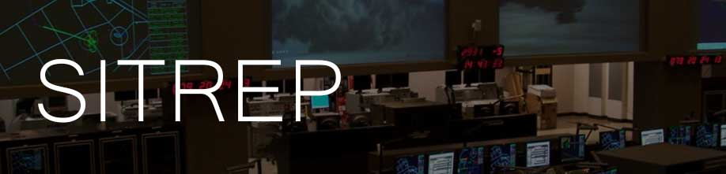

# Omnis Oculum Videntem
Segundo episódio da campanha em Esseker.

# 
Após ter estabelecido um posto avançado de operações a equipe Kaiser dá início as buscas pelo material nuclear roubado. No entanto, Corona faz contato com a equipe a algumas horas atrás e reporta uma novidade que pode pôr em risco toda a operação. Um contato no exército russo (Mikhail Vladimirovich) informou a AEGIS que além das baterias antiaéreas um drone de rastreamento de superfície percorre toda a área de exclusão, pois do contrário seriam necessárias muitas unidades para guardar todo o perímetro.  
O atraso dessa informação é preocupante, pois há uma grande possibilidade do drone ter detectado a movimentação da equipe Kaiser após a inserção. Infelizmente o drone opera em baixas altitudes impossibilitando o seu rastreamento por radares ou mesmo satélites. Dessa forma torna-se prioridade encontrar algum ponto de uplink do drone e hackear o sistema evitando que as imagens sejam transferidas, sem ser detectado pelo sistema.  

# 
Todos os mods abaixo são necessários para a campanha.
- [@ASR_AI3](http://www.armaholic.com/page.php?id=24080)
- [@ace3](https://github.com/acemod/ACE3/releases/download/v3.3.2/ace3_3.3.2.zip)
- [@acre2](http://acre.idi-systems.com/archive/acre2_2.1.0.763.zip)
- [@aegis](https://github.com/aegisarma3/ASIN/releases/download/v0.7/aegis.zip)
- [@allinarmaterrainpack](http://www.armaholic.com/page.php?id=26682)
- [@caf_ag](http://www.armaholic.com/page.php?id=24441)
- [@caf_ag_audiopatch](http://www.armaholic.com/page.php?id=26326)
- [@caf_hlc_wp_repl](http://www.armaholic.com/page.php?id=26654)
- [@cba_a3](http://www.armaholic.com/page.php?id=18767)
- [@DAC](http://www.armaholic.com/page.php?id=25550)
- [@em](http://www.armaholic.com/page.php?id=27224)
- [@esseker](https://mega.nz/#!CVwUxDZR!JZOghB0LME6OWTBIZPk3qAECcmUNvdnPYKfj19PX9Gw)
- [@hlcmods](http://www.armaholic.com/page.php?id=28329)
- [@melb](http://www.armaholic.com/page.php?id=28856)
- [@mrt_accfncs](http://www.armaholic.com/page.php?id=26426)
- [@plp_containers](http://www.armaholic.com/page.php?id=29295)
- [@sma](http://www.armaholic.com/page.php?id=26428)
- [@tryk](http://www.armaholic.com/page.php?id=26661)

## Mods utilizados no server:
- [@inidbi](http://www.armaholic.com/page.php?id=23340)
